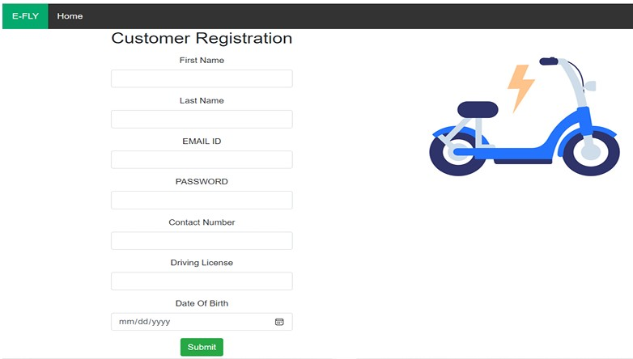

# E-Scooter-Booking-System

## Overview
The **E-Fly E-Scooter System** is a comprehensive web application designed to manage the booking and fleet management of electric scooters. It allows users to register, log in, book scooters, and track their past bookings. For administrators and managers, it offers a robust interface to manage inventory, user accounts, and monitor application performance through live dashboards. This system is ideal for customers looking for a convenient mode of transportation across Edinburgh.

### Key Features:
- **Customer Features:**
  - **User Registration:** New customers can register by providing their personal details.
  - **Booking:** Customers can search for available e-scooters and make bookings for specific times and locations.
  - **Past Bookings:** Customers can review and cancel their past bookings.
  
- **Admin Features:**
  - **Fleet Management:** Admins can add, remove, or update scooter inventory.
  - **User Management:** Admins can add or manage employee accounts (operators/managers).
  
- **Manager Features:**
  - **Live Dashboards:** Managers have access to real-time performance dashboards, showing key metrics such as active bookings, revenue, and operational status.

## Table of Contents
1. [System Overview](#overview)
2. [Technologies Used](#technologies-used)
3. [Installation & Setup](#installation-setup)
4. [Features](#features)
   - [Customer Features](#customer-features)
   - [Admin Features](#admin-features)
   - [Manager Features](#manager-features)
5. [Database Structure](#database-structure)
6. [Application Architecture](#application-architecture)
7. [Testing Methodology](#testing-methodology)
8. [Screenshots](#screenshots)
9. [References](#references)

## Technologies Used
The system has been developed using a range of web technologies to ensure robust performance and easy maintainability:

- **Frontend:**
  - **HTML5:** Markup language for structuring the web pages.
  - **CSS3:** Styling of the web pages to ensure a responsive and user-friendly interface.
  - **JavaScript (JSP):** Dynamic functionality for the frontend and user interactions.
  
- **Backend:**
  - **Java (Servlets):** Backend logic to process user requests and interact with the database.
  - **MariaDB (version 10.6):** Relational database management system to store user and booking data.
  - **Apache Tomcat (version 9.0):** Java-based server for deploying and managing the web application.

- **Architecture:** MVC (Model-View-Controller) design pattern to separate the concerns of data, user interface, and business logic.


### MVC


## Installation & Setup

### Prerequisites
Before you begin setting up the application, ensure the following software is installed on your system:

- **Apache Tomcat (version 9.0 or higher)**: The application will be hosted on this web server.
- **MariaDB (version 10.6 or higher)**: A relational database system to store data.
- **JDK (Java Development Kit)**: Required for running Java applications.

### Steps to Set Up

1. **Install Apache Tomcat:**
   - Download from the [Tomcat Download Page](https://tomcat.apache.org/download-90.cgi).
   - Unzip the downloaded file into your desired directory.
   - Start Tomcat using the `bin/start.bat` (for Windows) or `bin/start.sh` (for Linux/macOS).

2. **Install MariaDB:**
   - Download MariaDB from [MariaDB Download Page](https://mariadb.org/download/?t=mariadb&p=mariadb&r=10.6.8&os=windows&cpu=x86_64&pkg=msi&m=heanet-ltd).
   - Run the installer and follow the instructions to complete the installation.
   - Set the root password during installation, and make a note of the port (default: `3306`).

3. **Set Up the Database:**
   - Access MariaDB using `mysql -u root -p` in the terminal and log in with the root password.
   - Create the necessary database and tables using the provided SQL schema files in the report or execute the following commands:
     ```sql
     CREATE DATABASE efly;
     USE efly;
     -- Execute the table creation commands provided in the report (UserDetails, vehicleModel, etc.)
     ```
   - Insert test data into the tables using the `INSERT INTO` commands listed in the report.

4. **Configure Database Connection in the Application:**
   - Open the `InputVariables.java` file located in the `com/E_FLY/Common` directory.
   - Modify the database connection settings (`appDBUseName`, `appDBPass`, and `dbConn`) with your MariaDB credentials and port.

5. **Deploy the Application:**
   - Build the application into a WAR file (`F20DG-EFLY.war`).
   - Copy the WAR file into the `webapps` folder of the Apache Tomcat installation directory.

6. **Run the Application:**
   - Start the Tomcat server and open your browser.
   - Visit `http://localhost:8080/F20DG-EFLY/views/MainPage.jsp` to access the main page of the application.

## Features

### Customer Features
1. **User Registration:**
   - Customers provide details like email, phone number, and driving license.
   - Passwords are hashed using SHA-256 for security.
  
2. **Login:**
   - After registration, customers can log in using their email and hashed password.
  
3. **Booking E-Scooters:**
   - Customers can search for available e-scooters based on location and time, and confirm their booking.
  
4. **Booking History:**
   - Customers can view their past bookings and cancel any future bookings.

### Admin Features
1. **Manage Fleet:**
   - Admins can add new e-scooters to the fleet or remove unavailable scooters.
   - Admins can also manage the details of each scooter, such as availability status and repair history.
  
2. **User Management:**
   - Admins can add and manage employee accounts (operators or managers).
  
3. **Manage Dashboards:**
   - Admins have access to real-time dashboards displaying booking stats, revenue, and application performance.

### Manager Features
1. **Live Dashboards:**
   - Managers can view various real-time performance metrics such as active bookings, total revenue, and fleet availability.
  
2. **Operator Role:**
   - Managers have the ability to assign operators to manage day-to-day operations, including fleet management and booking oversight.

## Database Structure
The application uses MariaDB for persistent data storage, and the database schema includes the following tables:
- **UserDetails:** Stores customer registration information.
- **VehicleModel:** Stores information about scooter models.
- **LocationDetails:** Stores location data for pick-up and drop-off points.
- **BookingDetails:** Stores booking data, linking users to specific e-scooters.
- **EmployeeDetails:** Stores admin and operator information.

Each table is connected through foreign keys to maintain relational integrity, and data is stored securely with hashing algorithms applied to sensitive information such as passwords.

## Application Architecture
The application follows the **MVC (Model-View-Controller)** design pattern:
- **Model:** Contains Java classes that manage the data and perform CRUD operations (Create, Read, Update, Delete) using the DAO pattern.
- **View:** Web pages built using HTML, CSS, and JSP, which interact with users and display data.
- **Controller:** Java Servlets act as the controllers that process user input and interact with the model layer to update the database or display data.

## Testing Methodology

### Unit Testing
- **JUnit** was used for unit testing of individual features (e.g., user registration, login functionality, booking).
- Functional tests were also written to ensure each feature works as expected.

### Integration Testing
- After completing each iteration, all features were integrated into the system, and end-to-end testing was performed.
- Test cases were executed for user interactions, booking functionalities, and database operations.

### Example Test Scenarios:
- **Test Case 1:** Login with valid credentials.
- **Test Case 2:** Registration with invalid data (e.g., missing email).
- **Test Case 3:** Book a scooter with valid input, verify booking is stored in the database.

## Screenshots

### Main Page:


### Customer Registration Page:


### Customer Booking Page:


### Operator Dashboard:


### Manager Dashboard:


## References
1. **MVC Design Pattern - Research Hubs**  
   [MVC Design Pattern - Research Hubs](https://researchhubs.com/post/computing/web-application/the-model-view-vontroller-design-pattern.html)
   
2. **MariaDB Tutorial - Install MariaDB**  
   [MariaDB Tutorial - Install MariaDB](https://mariadbtutorial.com/getting-started/install-mariadb/)

3. **Tomcat 9.0 Download Page**  
   [Tomcat 9.0 Download Page](https://tomcat.apache.org/download-90.cgi)

4. **SHA-256 Encryption in Java**  
   [SHA-256 Encryption in Java - Example](https://www.baeldung.com/sha-256-encryption-java)


